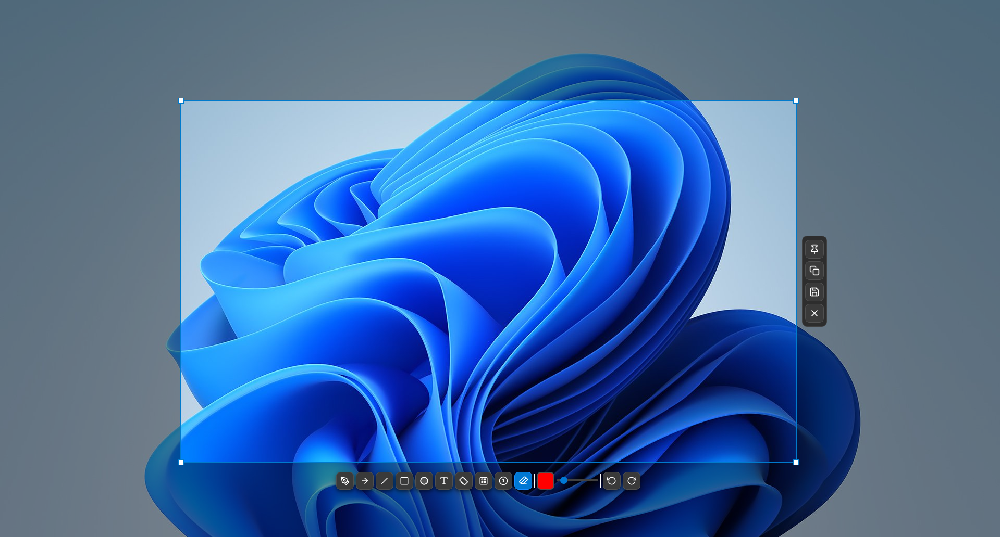

# EShot

A fast, lightweight screenshot tool for Windows with annotation tools, pin-to-desktop, and multi-monitor support.

[](LICENSE)
[]()
[]()
[]()

<p align="center">
  
</p>

## Features

### Capture
- **Multi-Monitor** — Pixel-perfect capture across all monitors with DPI awareness
- **Area Selection** — Click and drag to select any region
- **Corner Handles** — Resize selection precisely after capture
- **Dimension Tooltip** — Live size indicator next to cursor
- **Configurable Delay** — Set capture delay (0–10 seconds)
- **Copy After Capture** — Auto-copy to clipboard on selection complete

### Annotation Tools (10)
| Tool | Key | Description |
|------|-----|-------------|
| Pen | `P` | Freehand drawing with smooth Bezier curves |
| Arrow | `A` | Line with filled arrowhead |
| Line | `L` | Straight line (no arrowhead) |
| Rectangle | `R` | Rectangle (hold `Shift` for square) |
| Circle | `C` | Ellipse (hold `Shift` for perfect circle) |
| Text | `T` | Click to place text with dark background |
| Highlighter | `H` | Semi-transparent yellow stroke |
| Blur | `B` | Mosaic pixelation with real screen content |
| Counter | `#` | Auto-incrementing numbered markers |
| Eraser | `X` | Click to remove any annotation |

- **Undo/Redo** — Full undo/redo support (`Ctrl+Z` / `Ctrl+Y`)
- **Move Annotations** — Click any annotation to drag it
- **Color Picker** — Choose any color for tools
- **Pen Width** — Adjustable from 1–20px

### Pin to Desktop
- Pin any capture as an always-on-top floating window
- **Resize** — Drag corner handles to scale (preserves aspect ratio)
- **Opacity** — Scroll wheel to adjust transparency
- **Shift+Scroll** — Zoom in/out
- **Save As** — Right-click to save pinned image
- **Close All** — Tray menu option to close all pinned windows

### Settings (5 Tabs)
- **General** — Language, save directory, filename pattern, auto-start, notifications, sound
- **Capture** — Format (PNG/JPEG/BMP), quality, delay, copy-after-capture, close-after-copy
- **Appearance** — Dark/light theme, high contrast mode, overlay opacity, crosshair style
- **Interface** — Toolbar tool visibility (show/hide individual tools)
- **Hotkey** — Custom capture hotkey with Win32 key mapping

### Additional
- **7 Languages** — Turkish, English, German, French, Spanish, Japanese, Chinese
- **First-Run Wizard** — Guided setup on first launch (language, hotkey, save path)
- **Export/Import Settings** — Save/load all settings as JSON
- **Live Theme Switch** — Change dark/light/high-contrast without restart
- **Customizable Tray Icon** — Dark or light icon style
- **Auto-Update Check** — Notifications when new versions are available on GitHub
- **Command-Line Arguments** — `eshot --capture`, `eshot --save /path`
- **Smart Filename Templates** — `%Y` (year), `%M` (month), `%D` (day), `%h` (hour), `%m` (min), `%s` (sec), `%T` (window title)

## Keyboard Shortcuts

### Global
| Key | Action |
|-----|--------|
| `Print Screen` | Start capture (configurable) |

### During Capture
| Key | Action |
|-----|--------|
| `Left Click + Drag` | Select area |
| `Enter` / `Ctrl+C` | Copy to clipboard |
| `Ctrl+S` | Save to file |
| `Esc` | Cancel / reset selection |
| `Right Click` | Cancel (no selection) or reset (with selection) |

### Annotation Shortcuts
| Key | Action |
|-----|--------|
| `P` `A` `R` `C` `T` `H` `B` `#` `X` `L` | Select tool |
| `Ctrl+Z` | Undo |
| `Ctrl+Y` | Redo |
| `Shift` + Draw | Perfect square / circle |
| `Delete` | Delete selected annotation |

## Quick Start

Download the latest release from [Releases](https://github.com/Benoks/EShot/releases) and run the installer.

## Build from Source

### Requirements

- [Visual Studio Build Tools 2022](https://visualstudio.microsoft.com/visual-cpp-build-tools/) (MSVC)
- [Qt 6.8](https://www.qt.io/download-qt-installer) (Core, Gui, Widgets, Network)
- [CMake 3.16+](https://cmake.org/download/)
- [Inno Setup 6](https://jrsoftware.org/isinfo.php) (optional, for installer)

### Build

```bash
git clone https://github.com/Benoks/EShot.git
cd EShot
cmake -S . -B build -G "Visual Studio 17 2022" -DCMAKE_PREFIX_PATH="C:/Qt/6.8.0/msvc2022_64"
cmake --build build --config Release
```

The executable will be at `build/bin/Release/EShot.exe`.

### Create Installer

```bash
"C:\Program Files (x86)\Inno Setup 6\ISCC.exe" EShot_Setup.iss
```

Output: `installer_output/EShot_Setup_v2.1.0.exe`

## Tech Stack

- **Language:** C++17
- **UI Framework:** Qt 6.8 (Widgets)
- **Build System:** CMake
- **Platform API:** Win32 (`BitBlt`, `RegisterHotKey`, `GetSystemMetrics`)
- **Packaging:** Inno Setup 6

## Project Structure

```
EShot/
├── src/
│   ├── main.cpp                    # App entry, tray icon, hotkey, update check
│   ├── core/
│   │   ├── HotkeyManager.cpp       # Global hotkey via Win32 API
│   │   └── TranslationManager.h    # 7-language translation system
│   ├── capture/
│   │   ├── CaptureOverlay.cpp      # Full-screen overlay, selection, toolbar
│   │   ├── PinnedWindow.cpp        # Pin-to-desktop with resize/opacity
│   │   └── PinManager.cpp          # Pin persistence (unused in v2.1)
│   ├── annotation/
│   │   └── AnnotationEngine.cpp    # 10 drawing tools + undo/redo
│   └── ui/
│       ├── AnnotationToolbar.cpp   # Floating toolbar with tools
│       ├── SettingsDialog.cpp      # Settings (5 tabs, export/import)
│       ├── AboutDialog.cpp         # About window
│       └── FirstRunWizard.cpp      # First-run setup wizard
├── icons/                          # SVG icons for tools & UI
├── resources/                      # Qt resource files, stylesheet
├── EShot_Setup.iss                 # Inno Setup installer script
└── EShot_Release/                  # Pre-built release binaries
```

## Contributing

Contributions are welcome! Please open an issue first to discuss what you'd like to change.

## License

[MIT](LICENSE)
